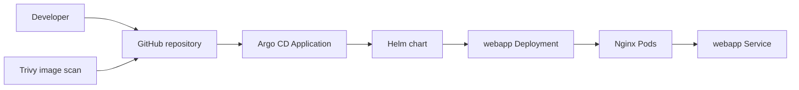
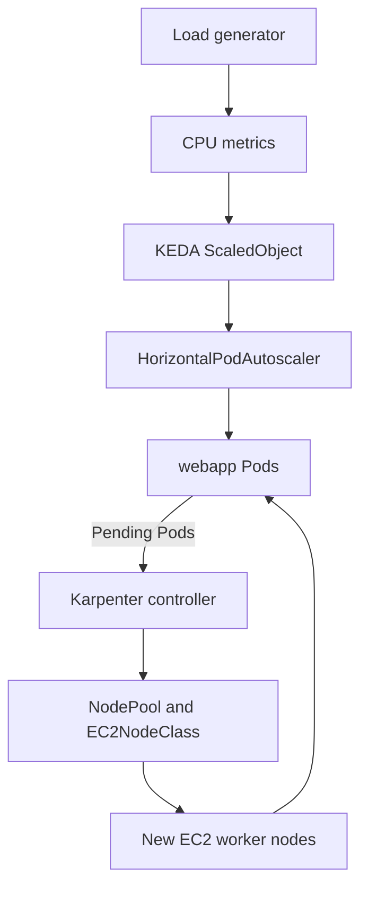
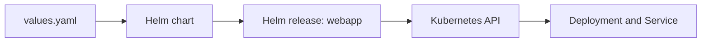
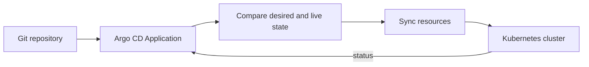
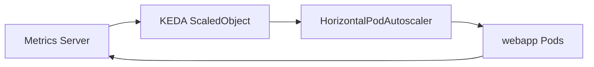
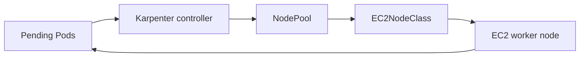
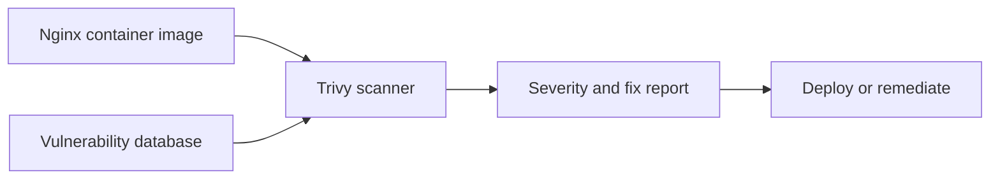

# Kubernetes Cloud Native Tools

Basic examples for learning one tool at a time.

| Tool      | What you learn               | Instructions                            |
| --------- | ---------------------------- | --------------------------------------- |
| Helm      | Package and deploy Nginx     | [Helm lesson](helm/README.md)           |
| Trivy     | Scan the Nginx image         | [Trivy lesson](trivy/README.md)         |
| Argo CD   | Sync the Helm chart from Git | [Argo CD lesson](argocd/README.md)      |
| KEDA      | Scale application Pods       | [KEDA lesson](keda/README.md)           |
| Karpenter | Add EC2 worker nodes         | [Karpenter lesson](karpenter/README.md) |

## Quick comparison

| Tool      | Short definition                      | Main use case                                |
| --------- | ------------------------------------- | -------------------------------------------- |
| Helm      | Kubernetes package manager            | Install and upgrade applications             |
| Argo CD   | GitOps continuous delivery controller | Sync cluster state from Git                  |
| KEDA      | Event-driven autoscaler               | Scale Pods from metrics or events            |
| Karpenter | Kubernetes node provisioner           | Add worker nodes for pending Pods            |
| Trivy     | Container security scanner            | Find image vulnerabilities before deployment |

## Common use cases

- Package and deploy applications with Helm.
- Manage Kubernetes deployments declaratively with Argo CD and Git.
- Scale workloads automatically with KEDA.
- Provision right-sized EC2 worker nodes with Karpenter.
- Scan container images for security vulnerabilities with Trivy.

## Folder structure

```text
.
├── helm/
│   ├── README.md
│   └── webapp/
│       ├── Chart.yaml
│       ├── values.yaml
│       └── templates/
│           ├── deployment.yaml
│           └── service.yaml
├── argocd/
│   ├── README.md
│   ├── application.yaml
│   └── autoscaling-patch.yaml
├── keda/
│   ├── README.md
│   ├── scaledobject.yaml
│   └── load-generator.yaml
├── karpenter/
│   ├── README.md
│   ├── ec2nodeclass.yaml
│   ├── nodepool.yaml
│   └── capacity-demo.yaml
└── trivy/
    └── README.md
```

## Prerequisites

- An existing Kubernetes cluster and configured `kubectl`.
- Helm and Trivy installed locally.
- A GitHub repository for the Argo CD lesson.
- Metrics Server for KEDA CPU scaling.
- EKS, an installed Karpenter controller, and its AWS permissions for node scaling.

## Architecture diagrams

### Deployment flow



Trivy checks the container image before the chart is deployed. Argo CD watches
the Git repository and keeps the Kubernetes resources synchronized.

### Scaling and node provisioning



KEDA changes the number of application Pods. Karpenter adds EC2 nodes only
when the cluster does not have enough capacity for pending Pods.

### Helm architecture



### Argo CD architecture



### KEDA architecture



### Karpenter architecture



### Trivy architecture



Check your cluster:

```bash
kubectl config current-context
kubectl get nodes
helm version
trivy --version
```

## Start here

Run all lesson commands from the repository root. The examples use release
`webapp` in namespace `default`.

```bash
helm lint ./helm/webapp
helm template webapp ./helm/webapp
helm install webapp ./helm/webapp --namespace default
kubectl get pods,svc -n default
```

## Run the lessons in sequence

Use this sequence for a complete walkthrough. Run each block after the
previous block succeeds. The Argo CD step requires the repository to be pushed
to GitHub, and the Karpenter step requires the AWS-specific placeholders in
`karpenter/ec2nodeclass.yaml` to be replaced first.

### 1. Verify the cluster and scan the image

```bash
kubectl config current-context
kubectl get nodes
helm version
trivy --version
trivy image --severity HIGH,CRITICAL nginx:latest
```

### 2. Validate and deploy with Helm

```bash
helm lint ./helm/webapp
helm template webapp ./helm/webapp
helm install webapp ./helm/webapp --namespace default
kubectl rollout status deployment/webapp -n default
kubectl get pods,svc -n default
```

### 3. Install Argo CD and connect the Helm chart

Update `repoURL` in `argocd/application.yaml`, commit and push the change,
then run:

```bash
kubectl create namespace argocd
kubectl apply -n argocd --server-side --force-conflicts -f https://raw.githubusercontent.com/argoproj/argo-cd/stable/manifests/install.yaml
kubectl wait --for=condition=Available deployment/argocd-server -n argocd --timeout=180s
kubectl apply -f argocd/application.yaml
kubectl get applications -n argocd
kubectl get pods,svc -n default
```

Keep KEDA disabled for the fixed-replica Argo CD lesson. To access the Argo CD
UI, run this in a separate terminal:

```bash
kubectl port-forward svc/argocd-server -n argocd 8080:443
```

### 4. Enable KEDA scaling

```bash
helm repo add kedacore https://kedacore.github.io/charts
helm repo update
helm install keda kedacore/keda --namespace keda --create-namespace --wait
kubectl top pods -n default
kubectl patch application webapp -n argocd --type merge --patch-file argocd/autoscaling-patch.yaml
kubectl apply -f keda/scaledobject.yaml
kubectl apply -f keda/load-generator.yaml
kubectl get scaledobject,hpa -n default
kubectl get pods -n default -w
```

Stop the `kubectl` watch with `Ctrl-C` after observing the replicas scale.

### 5. Provision Karpenter capacity

After replacing the values described above in `karpenter/ec2nodeclass.yaml`:

```bash
kubectl apply -f karpenter/ec2nodeclass.yaml
kubectl apply -f karpenter/nodepool.yaml
kubectl wait --for=condition=Ready ec2nodeclass/demo --timeout=120s
kubectl wait --for=condition=Ready nodepool/demo --timeout=120s
kubectl apply -f karpenter/capacity-demo.yaml
kubectl scale deployment capacity-demo -n default --replicas=20
kubectl get pods -n default -l app=capacity-demo -w
```

In another terminal, observe node provisioning:

```bash
kubectl get nodes -w
```

### 6. Clean up

Run cleanup in reverse order:

```bash
kubectl delete -f karpenter/capacity-demo.yaml --ignore-not-found
kubectl delete -f karpenter/nodepool.yaml --ignore-not-found
kubectl delete -f karpenter/ec2nodeclass.yaml --ignore-not-found
kubectl delete -f keda/load-generator.yaml --ignore-not-found
kubectl delete -f keda/scaledobject.yaml --ignore-not-found
kubectl delete -f argocd/application.yaml --ignore-not-found
helm uninstall webapp --namespace default
```

Follow the lessons in the table's order. Each folder includes commands to apply,
observe, and clean up its example. The `latest` Nginx tag keeps the classroom
example simple; use a tested version when you need repeatable results.

## How the tools connect

```text
Git → Argo CD → Helm chart → Nginx Pods
                               ↑
                         KEDA scales Pods
                               ↓
                         Pending Pods
                               ↓
                    Karpenter adds nodes

Trivy scans the container image before deployment.
```

For the Argo CD replica-change lesson, keep KEDA disabled. When running both
controllers together, use the optional patch in the Argo CD folder so KEDA
controls replicas. The Karpenter lesson uses a separate capacity Deployment.

Cloud load balancers and EC2 nodes incur charges. Follow each lesson's cleanup
steps afterward; the existing cluster and installed controllers remain.
